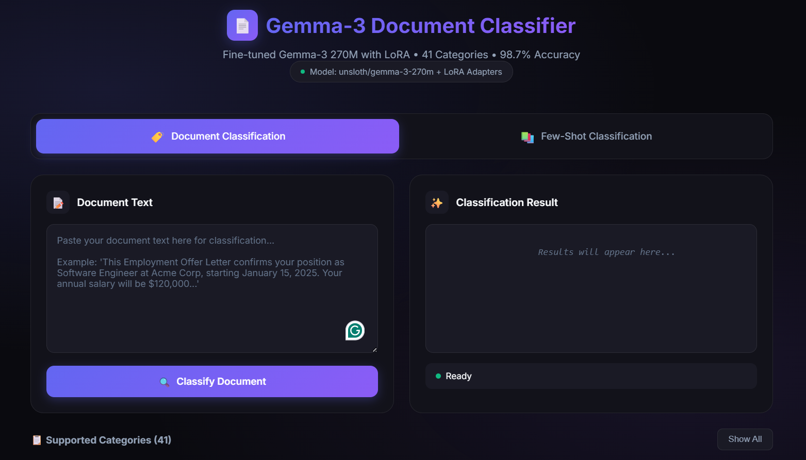
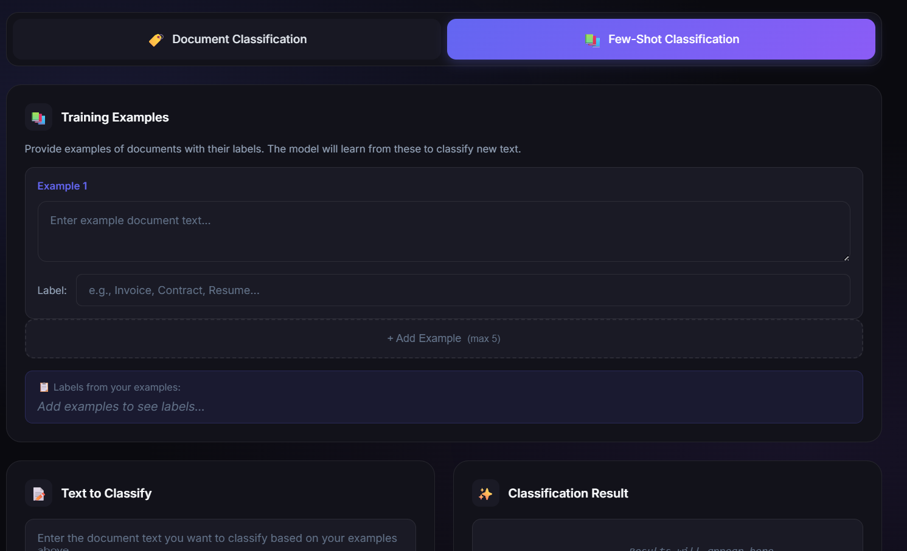
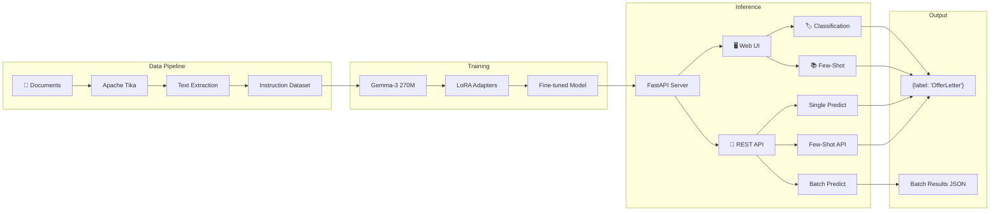

# Gemma-3 270M Document Classifier

> 🚀 **End-to-end pipeline for fine-tuning Gemma-3 270M with LoRA for document classification (41 subcategories)**

[](https://www.python.org/downloads/)
[](https://opensource.org/licenses/MIT)

## ✨ Features

- **Prompt-based classification** - Instruction-style fine-tuning
- **JSON output only** - Clean `{"label": "<subcategory>"}` output
- **LoRA adapters** - Base model stays frozen, retains all capabilities
- **Few-shot generalization** - Add new categories via prompt without retraining
- **CPU/GPU compatible** - Auto-detects and optimizes for your hardware
- **FastAPI inference** - Production-ready REST API
- **Web UI** - Interactive interface for classification and chat
- **Comprehensive evaluation** - Per-class F1, confusion matrix, error analysis

---

## 🖼️ Screenshots

### Document Classification Mode


### Few-Shot Classification Mode


---

## 📊 Architecture


---

## 🚀 Quick Start

> [!IMPORTANT]
> **Authentication Required**: `google/gemma-3-270m` is a gated model. You must:
> 1. [Access the model page](https://huggingface.co/google/gemma-3-270m) and accept the license.
> 2. Create a [Hugging Face User Access Token](https://huggingface.co/settings/tokens) (Read permission).
> 3. Login in your terminal:
>    ```bash
>    huggingface-cli login
>    # Paste your token when prompted
>    ```

### 1. Install Dependencies

**Using Conda (Recommended):**
```bash
# Create and activate environment
conda create -n gemma_classifier -c conda-forge python=3.10 openjdk pip -y
conda activate gemma_classifier

# Install dependencies
pip install -r requirements.txt
```

**Using venv:**

```bash
# Clone repository
cd gemma-doc-classifier

# Create virtual environment (recommended)
python -m venv venv
venv\Scripts\activate  # Windows
# source venv/bin/activate  # Linux/Mac

# Install dependencies
pip install -r requirements.txt
```

**Prerequisites:**
- Python 3.8+
- Java 8+ (for Apache Tika)
- CUDA 11.8+ (optional, for GPU)

### 2. Prepare Your Data

Organize documents in this structure:
```
data/
├── OfferLetter/
│   ├── doc1.pdf
│   └── doc2.docx
├── SalaryStructure/
│   └── file1.pdf
└── <YourSubcategory>/
    └── ...
```

### 3. Extract Text

```bash
# Extract text from all documents
python scripts/extract_text.py --input_dir data/ --output extracted.jsonl

# Validate structure (no extraction)
python scripts/extract_text.py --input_dir data/ --output test.jsonl --validate-only
```

### 4. Create Training Dataset

```bash
# Create train/val/test splits
python scripts/prepare_dataset.py --input extracted.jsonl --output_dir data/processed/
```

Output:
```
data/processed/
├── train.jsonl
├── val.jsonl
├── test.jsonl
└── label_mapping.json
```

### 5. Train Model

```bash
# Full training
python training/train_lora.py --config training/config.yaml

# Dry run (validate setup)
python training/train_lora.py --config training/config.yaml --dry-run

# Quick test (5 steps)
python training/train_lora.py --config training/config.yaml --max-steps 5
```

### 6. Evaluate

```bash
python evaluation/evaluate.py \
    --model_path output/lora_adapters/final \
    --test_file data/processed/test.jsonl \
    --output_dir eval_results/
```

### 7. Start API Server

```bash
# Start server
uvicorn inference.api:app --host 0.0.0.0 --port 8000

# Test endpoint
curl -X POST http://localhost:8000/predict \
    -H "Content-Type: application/json" \
    -d '{"text": "This employment offer confirms your position..."}'
```

**Response:**
```json
{"label": "OfferLetter"}
```

---

## 📁 Repository Structure

```
gemma-doc-classifier/
├── 📂 data/                    # Your documents go here
├── 📂 scripts/
│   ├── extract_text.py         # Tika text extraction
│   ├── prepare_dataset.py      # Dataset preparation
│   └── batch_classify.py       # Batch classification CLI
├── 📂 training/
│   ├── config.yaml             # Training hyperparameters
│   ├── prompts.py              # Prompt templates
│   ├── dataset.py              # PyTorch dataset class
│   └── train_lora.py           # LoRA fine-tuning script
├── 📂 evaluation/
│   ├── metrics.py              # Metrics computation
│   └── evaluate.py             # Evaluation script
├── 📂 inference/
│   ├── predictor.py            # Core prediction class
│   └── api.py                  # FastAPI application
├── 📂 ui/
│   └── index.html              # Web interface
├── 📂 diagrams/                # Architecture diagrams
├── requirements.txt
└── README.md
```

---

## 📋 Prompt Template

The model uses this instruction format:

```
<bos><start_of_turn>user
You are a document classification assistant...

Valid subcategories:
Category1, Category2, Category3, ...

---
DOCUMENT:
[Your document text here]
---

Classify this document into exactly one subcategory.<end_of_turn>
<start_of_turn>model
{"label": "Category1"}
```

---

## ⚙️ Configuration Reference

Key settings in `training/config.yaml`:

| Parameter | Default | Description |
|-----------|---------|-------------|
| `model_name` | `google/gemma-3-270m` | Base model |
| `max_seq_length` | `4096` | Max tokens per sample |
| `num_train_epochs` | `3` | Training epochs |
| `learning_rate` | `2e-4` | Peak learning rate |
| `lora.r` | `16` | LoRA rank |
| `lora.alpha` | `32` | LoRA alpha |
| `per_device_train_batch_size` | `2` | Batch size (lower for CPU) |
| `gradient_accumulation_steps` | `8` | Effective batch = batch × accumulation |

---

## 🔌 API Endpoints

| Endpoint | Method | Description |
|----------|--------|-------------|
| `/predict` | POST | Classify single document |
| `/predict_batch` | POST | Classify up to 100 documents |
| `/predict_fewshot` | POST | Few-shot classification |
| `/health` | GET | Health check |
| `/info` | GET | Model info |
| `/docs` | GET | Swagger documentation |

### Example: Batch Prediction

```bash
curl -X POST http://localhost:8000/predict_batch \
    -H "Content-Type: application/json" \
    -d '{
        "texts": [
            "Document 1 text...",
            "Document 2 text..."
        ]
    }'
```

### Example: Few-Shot (New Categories)

```bash
curl -X POST http://localhost:8000/predict_fewshot \
    -H "Content-Type: application/json" \
    -d '{
        "text": "New document to classify...",
        "examples": [
            {"document": "Example 1...", "label": "NewCategory"},
            {"document": "Example 2...", "label": "NewCategory"}
        ]
    }'
```

---

## ⚠️ Common Mistakes & Debugging

### 1. "Java not found" Error

Apache Tika requires Java:
```bash
# Check Java
java -version

# If not installed (Windows):
winget install Oracle.JDK.21

# Set JAVA_HOME if needed
set JAVA_HOME=C:\Program Files\Java\jdk-21
```

### 2. Out of Memory (OOM) During Training

Reduce memory usage:
```yaml
# In config.yaml
per_device_train_batch_size: 1  # Reduce batch size
gradient_accumulation_steps: 16  # Increase accumulation
use_quantization: true           # Enable 4-bit quantization
```

### 3. Model Outputs Garbage

Check template format:
- Ensure your test prompt matches training format exactly
- Gemma-3 is sensitive to special tokens (`<bos>`, `<start_of_turn>`, etc.)

### 4. Low F1 on Some Classes

Class imbalance solutions:
- Add more examples for underperforming classes
- Increase `num_train_epochs` for rare classes
- Use weighted sampling (modify `dataset.py`)

### 5. API Returns "Model not loaded"

```bash
# Check if model path exists
ls output/lora_adapters/final/

# Reload model via API
curl -X POST "http://localhost:8000/reload?model_path=output/lora_adapters/final"
```

### 6. Training Loss Not Decreasing

Debug steps:
1. Verify data format: `cat data/processed/train.jsonl | head -1 | python -m json.tool`
2. Check learning rate: Try `1e-4` instead of `2e-4`
3. Validate tokenization: Check `max_seq_length` isn't truncating too much

---

## 📈 Achieved Results

Fine-tuned on 41 document categories with ~840 test samples:

| Metric | Achieved |
|--------|----------|
| **Accuracy** | **98.7%** |
| **Macro F1** | 0.986 |
| **JSON Valid Rate** | 100% |

> [!TIP]
> All 41 categories achieved F1 ≥ 0.90, with 27 categories at perfect F1 = 1.00.

---

## 🖥️ Web UI

A modern, responsive web interface is available for interactive inference.

### Start the Server

```bash
# Start API server
python -m uvicorn inference.api:app --reload --port 8000
```

### Access the UI

Open [http://localhost:8000](http://localhost:8000) in your browser.

### Features

| Mode | Description |
|------|-------------|
| **🏷️ Document Classification** | Classify documents using pre-trained 41 categories |
| **📚 Few-Shot Classification** | Define custom categories via examples (2-5 examples) |

---

## 📦 Batch Classification CLI

Classify multiple documents from a directory structure using the command-line interface.

### Directory Structure

Organize documents where **subdirectory names = ground truth labels**:

```
test_data/
├── OfferLetter/
│   ├── doc1.txt
│   └── doc2.txt
├── SalaryStructure/
│   └── salary.txt
└── Contract/
    └── contract.txt
```

### Usage

```bash
python scripts/batch_classify.py \
    --input_dir ./test_data \
    --output_file ./results.json \
    --model_path ./output/lora_adapters/final
```

### Options

| Option | Default | Description |
|--------|---------|-------------|
| `--input_dir`, `-i` | Required | Directory with label subdirectories |
| `--output_file`, `-o` | `batch_results.json` | Output file path |
| `--model_path`, `-m` | `output/lora_adapters/final` | LoRA adapter path |
| `--format`, `-f` | `json` | Output format (`json` or `csv`) |
| `--no-categories` | False | Don't provide category hints to model |

### Output

The script generates:
- **Per-file predictions** with ground truth comparison
- **Per-category accuracy** breakdown
- **Overall accuracy** summary

Example output:
```
============================================================
CLASSIFICATION SUMMARY
============================================================
Total files processed: 50
Correct predictions:   48
Overall accuracy:      96.00%

Per-category breakdown:
  OfferLetter                    15/15 (100.0%)
  SalaryStructure                18/20 (90.0%)
  Contract                       15/15 (100.0%)
============================================================
```

---

## 🔄 Adding New Categories

The model retains few-shot learning capability. To classify new categories:

1. **Without retraining**: Use `/predict_fewshot` with 2-5 examples
2. **With retraining**: Add documents to `data/<NewCategory>/`, re-run pipeline

---

## 🛠️ Environment Variables

| Variable | Default | Description |
|----------|---------|-------------|
| `MODEL_PATH` | `output/lora_adapters/final` | LoRA adapter path |
| `BASE_MODEL` | `google/gemma-3-270m` | Base model name |
| `HOST` | `0.0.0.0` | API host |
| `PORT` | `8000` | API port |

---

## 📜 License

MIT License - feel free to use and modify.

---

## 🙏 Acknowledgments

- [Google Gemma](https://ai.google.dev/gemma) - Base model
- [Hugging Face PEFT](https://github.com/huggingface/peft) - LoRA implementation
- [Apache Tika](https://tika.apache.org/) - Document parsing
