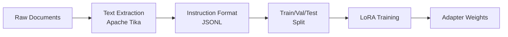

# Technical Deep Dive: LoRA Fine-Tuning for Document Classification

> This document explains how LoRA (Low-Rank Adaptation) works and answers common technical questions about this fine-tuning approach.

---

## Table of Contents

1. [What is LoRA?](#what-is-lora)
2. [Do We Have Two Models?](#do-we-have-two-models)
3. [Why is the LoRA Adapter Large?](#why-is-the-lora-adapter-large)
4. [Can the Fine-Tuned Model Do Normal Tasks?](#can-the-fine-tuned-model-do-normal-tasks)
5. [How Does Few-Shot Classification Work?](#how-does-few-shot-classification-work)
6. [Training Process Details](#training-process-details)
7. [Inference Flow](#inference-flow)

---

## What is LoRA?

**LoRA (Low-Rank Adaptation)** is a parameter-efficient fine-tuning technique that adds small trainable matrices alongside the frozen base model weights.

### How It Works

```
Original Weight Matrix W (frozen)
         ↓
    [W] + [A × B]
         ↑
   LoRA Adapters (trainable)
   - A: (d × r) matrix
   - B: (r × k) matrix
   - r: rank (typically 8-64)
```

Instead of updating the entire weight matrix `W` (millions of parameters), LoRA:

1. **Freezes** the base model weights
2. **Adds** two small matrices `A` and `B` with rank `r`
3. **Trains** only these small matrices
4. **During inference**: `output = W·x + (A·B)·x`

### Benefits

| Aspect | Full Fine-Tuning | LoRA |
|--------|------------------|------|
| Trainable Parameters | 100% | ~0.1-1% |
| Memory Required | Very High | Low |
| Training Speed | Slow | Fast |
| Base Model | Modified | Unchanged |
| Multiple Tasks | Need multiple copies | Swap adapters |

---

## Do We Have Two Models?

**No, but also yes.** Here's the breakdown:

### What's Actually Stored

```
📁 Base Model (unsloth/gemma-3-270m)
├── Downloaded from HuggingFace
├── ~540MB of weights
└── NEVER modified, always frozen

📁 LoRA Adapters (output/lora_adapters/final/)
├── Your trained adapter weights
├── adapter_config.json (configuration)
├── adapter_model.safetensors (weights)
└── tokenizer files
```

### During Inference

```
┌─────────────────────────────────────┐
│           Combined Model            │
│  ┌───────────┐    ┌──────────────┐  │
│  │ Base Model│ +  │LoRA Adapters │  │
│  │ (frozen)  │    │ (trained)    │  │
│  └───────────┘    └──────────────┘  │
└─────────────────────────────────────┘
              ↓
         Predictions
```

### Key Points

- **You need BOTH** the base model AND the adapters for inference
- **Base model is not duplicated** - downloaded once, used by many adapters
- **Swappable adapters** - Same base model can use different LoRA adapters for different tasks

---

## Why is the LoRA Adapter Large?

Your LoRA adapter is ~680MB, which may seem large for "efficient" fine-tuning. Here's why:

### What's in the Adapter Directory

```
output/lora_adapters/final/
├── adapter_model.safetensors  (~500-600MB)  ← Main adapter weights
├── adapter_config.json        (few KB)
├── tokenizer.json             (~10MB)       ← Tokenizer copy
├── tokenizer_config.json      (few KB)
└── special_tokens_map.json    (few KB)
```

### Why the Weights Are Large

1. **High Rank (`r`)**: We used `r=16` or higher. Higher rank = more parameters.
   ```
   Params per layer ≈ 2 × d × r
   With d=2048 and r=16: ~65K per layer
   Across 100+ layers: ~6.5M+ params
   ```

2. **Multiple Target Modules**: LoRA was applied to:
   - Query projections (`q_proj`)
   - Key projections (`k_proj`)
   - Value projections (`v_proj`)
   - Output projections (`o_proj`)
   - MLP layers (`gate_proj`, `up_proj`, `down_proj`)

3. **Float16 Precision**: Each parameter = 2 bytes

### Comparison

| LoRA Rank | Approximate Size |
|-----------|------------------|
| `r=8` | ~300MB |
| `r=16` | ~600MB |
| `r=32` | ~1.2GB |
| `r=64` | ~2.4GB |

> **Note**: Even at 680MB, this is still ~40% smaller than the full model weights, and training was 10x faster than full fine-tuning.

---

## Can the Fine-Tuned Model Do Normal Tasks?

**Partially, but with caveats:**

### What Works

- The **base model capabilities are preserved** - LoRA is additive, not destructive
- General language understanding remains intact
- The model can still follow instructions

### What's Degraded

- **The model's output format is biased toward classification**
- Training taught it to respond with `{"label": "..."}` format
- For chat, it may produce:
  - Shorter responses
  - Attempts to classify instead of chat
  - Repetitive patterns
  - Gibberish (especially for 270M model)

### Why This Happens

```
Training Distribution:
  Input: "Classify this document..."
  Output: {"label": "OfferLetter"}

Fine-tuning shifts the model's response patterns toward this format.
```

### Recommendations

| Task | Approach |
|------|----------|
| Classification | Use LoRA-enhanced model ✅ |
| General Chat | Use base model without LoRA |
| Best Results | Load base model separately for chat |

---

## How Does Few-Shot Classification Work?

Few-shot classification allows you to classify documents into **new categories not seen during training**, without retraining.

### How It Works

Instead of just sending the document to classify, you include examples:

```
EXAMPLES:
Example 1:
Document: "This is a patent application for..."
Classification: {"label": "PatentApplication"}

Example 2:
Document: "Regarding the patent filing..."
Classification: {"label": "PatentApplication"}

---
NEW DOCUMENT TO CLASSIFY:
[Your document here]
---

Classify this document.
```

### Why It Works

1. **In-context learning**: LLMs can learn patterns from examples in the prompt
2. **Pattern matching**: The model recognizes the format and applies it
3. **Base capability preserved**: LoRA didn't destroy this ability

### API Usage

```bash
curl -X POST http://localhost:8000/predict_fewshot \
    -H "Content-Type: application/json" \
    -d '{
        "text": "Document to classify...",
        "examples": [
            {"document": "Example patent doc...", "label": "PatentApplication"},
            {"document": "Another patent...", "label": "PatentApplication"}
        ]
    }'
```

### Best Practices

| Tip | Reason |
|-----|--------|
| Use 2-5 examples | More examples = better accuracy, but diminishing returns |
| Diverse examples | Cover different writing styles/formats |
| Truncate long docs | Only first ~500 chars needed from examples |
| Consistent labels | Use exact same label string across examples |

---

## Training Process Details

### Data Flow



### Training Prompt Format

```
<bos><start_of_turn>user
You are a document classification assistant...

Valid subcategories:
AdmissionForm, ArticlesOfOrganization, ...

---
DOCUMENT:
[Document text here]
---

Classify this document into exactly one subcategory.<end_of_turn>
<start_of_turn>model
{"label": "OfferLetter"}<end_of_turn>
```

### Key Training Hyperparameters

| Parameter | Value | Purpose |
|-----------|-------|---------|
| `lora_r` | 16 | Rank of adaptation matrices |
| `lora_alpha` | 32 | Scaling factor (alpha/r = 2) |
| `learning_rate` | 2e-4 | Peak learning rate |
| `epochs` | 3 | Training epochs |
| `batch_size` | 2 | Per-device batch size |
| `gradient_accumulation` | 8 | Effective batch = 16 |
| `max_seq_length` | 4096 | Maximum tokens per sample |

### What Gets Trained

```
Target modules:
- q_proj, k_proj, v_proj  (attention)
- o_proj                  (attention output)
- gate_proj, up_proj      (MLP)
- down_proj               (MLP)
```

---

## Inference Flow

### Classification Mode

```
1. User sends document text
2. Format prompt with categories list:
   "<bos><start_of_turn>user
   [System prompt]
   Valid subcategories: [41 categories]
   DOCUMENT: [text]
   Classify...<end_of_turn>
   <start_of_turn>model"
3. Model generates: {"label": "CategoryName"}
4. Parse JSON, extract label
5. Return result
```

### Critical: Categories in Prompt

The model was trained always seeing the list of valid categories. **If you don't include categories during inference, accuracy drops from 98% to ~20%.**

```python
# ❌ Wrong (23% accuracy)
prompt = f"Classify this: {document}"

# ✅ Correct (98% accuracy)
prompt = f"""
Valid subcategories: {categories}
DOCUMENT: {document}
Classify...
"""
```

---

## Summary

| Question | Answer |
|----------|--------|
| Two models? | No - base model + LoRA adapters loaded together |
| Normal tasks? | Limited - model biased toward classification format |
| Adapter size? | Large due to high rank and many target modules |
| Few-shot? | Works via in-context learning, no retraining needed |
| Key gotcha | Must include categories list in inference prompt |
